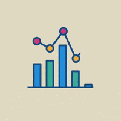
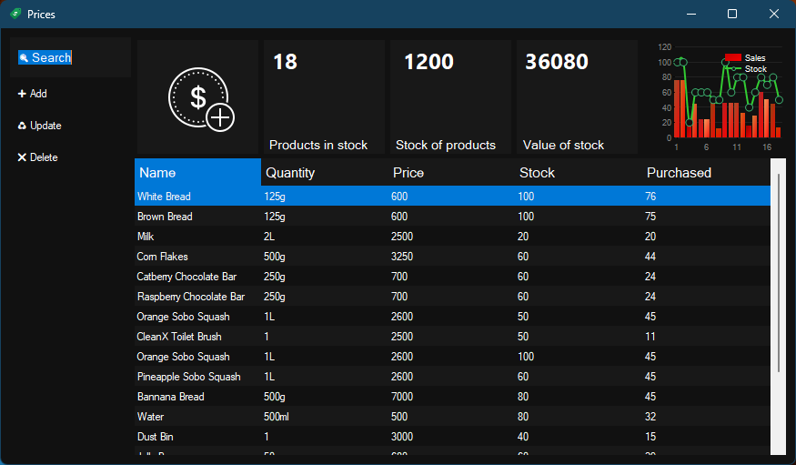

# PriceTag 

## Description

This simple application presents a search bar to browse its database dynamically while typing and will allow input of items with the name, quantity and price

## Funtions

- Show items in database
- Add items to database
- Remove items from database
- Update item details in database
- Search for items in database

## Main interface

The main interface comes with a minimal set of 3 controls that appear as buttons and are available in a context menu when the user right clicks on the data grid. A glance of the stock values are presented at the top and updated dynamically.

## Economy

The application takes a fair amount of space on your desktop to allow you to multitask between your stock and other finances. Its purpose is to get a lot of work done with a few clicks.

## Adding items

Adding items is as easy as filling in a form, a very straight forward form. Most of what you will need will be asked and it may most certainly be available in a real world case scenario.

